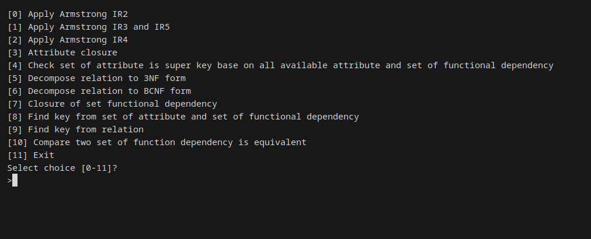
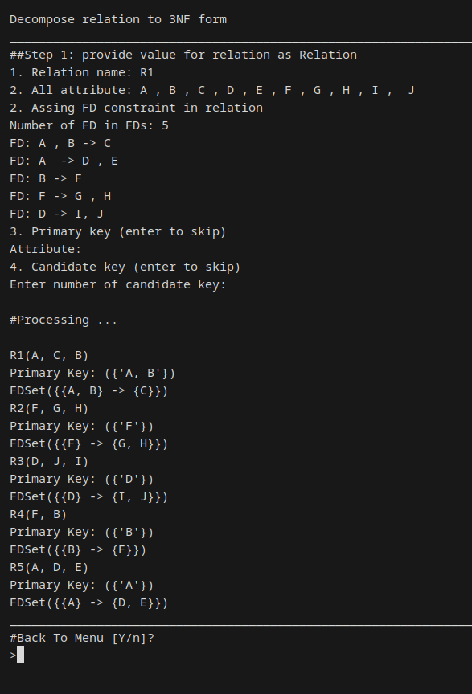
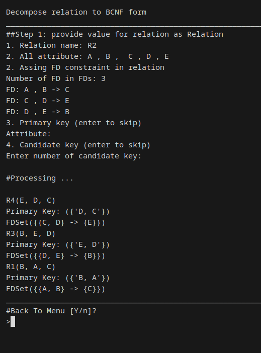

# Overview 
Just a tool to simplify relation normalization process.






# Usage 
```bash 
python3 main.py 
```


# Todos
- [x] Attribute closure 
- [x] Armstrong: ir2, ir3, ir4, ir5
- [x] Check two Functional Dependency (FD) set is equivalent
- [x] Find closure Functional Dependency set (FDs) from Armstrong rule set
- [x] Minimal cover of FDs
- [x] Find key from FDs
- [x] Check collection of attribute is super key of relation 
- [x] Decompose relation to 3NF from FDs
- [x] Decompose relation to BCNF from FDs
- [x] Menu interactive
- [ ] Check current Normal Form of relation (in general normal form definition)
- [ ] Test Nonadditive Join Property after decomposition relation
- [ ] Args parser integrate click
- [ ] Reduce random order of set iterator in minimal_cover method


# Issues
If you encounter any issues while using feel free to open a new issue. When reporting an issue, please include any relevant logs or screenshots.

# Disclaimers
All code is kept in one file for portability and ease of execution.

Manually providing user inputs became tedious, so I implemented dynamic input injection.
